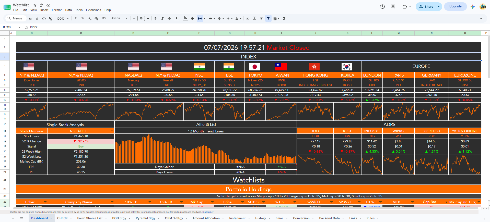
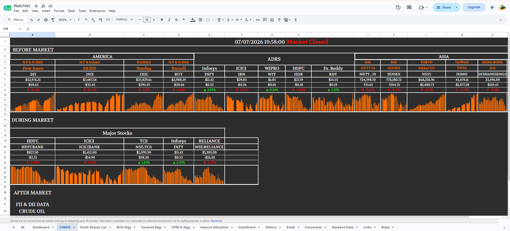
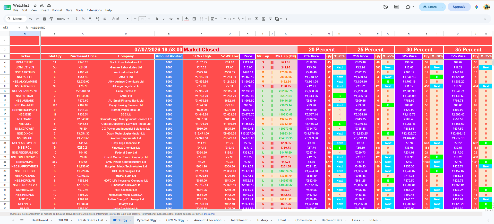
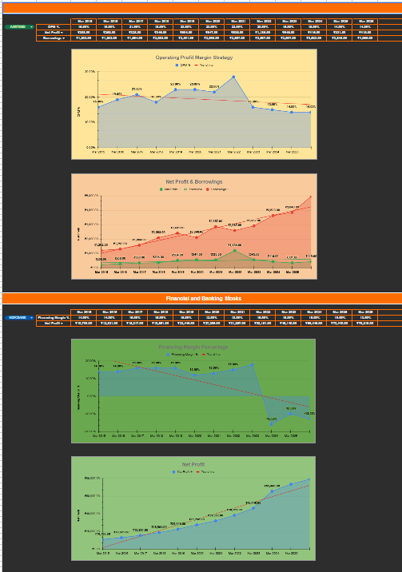
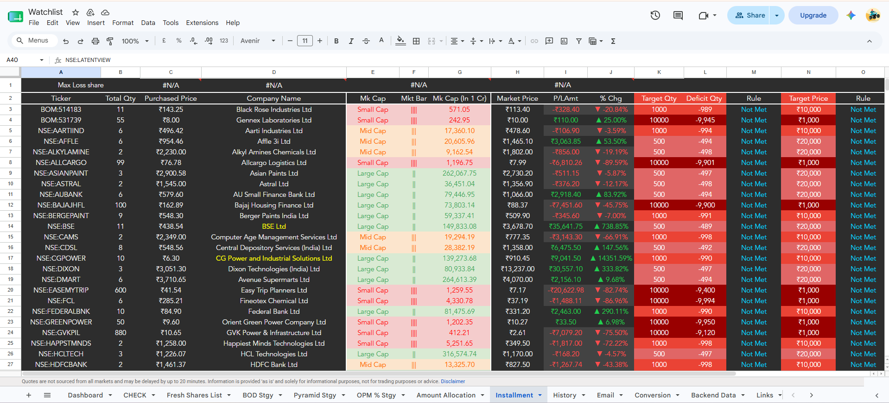
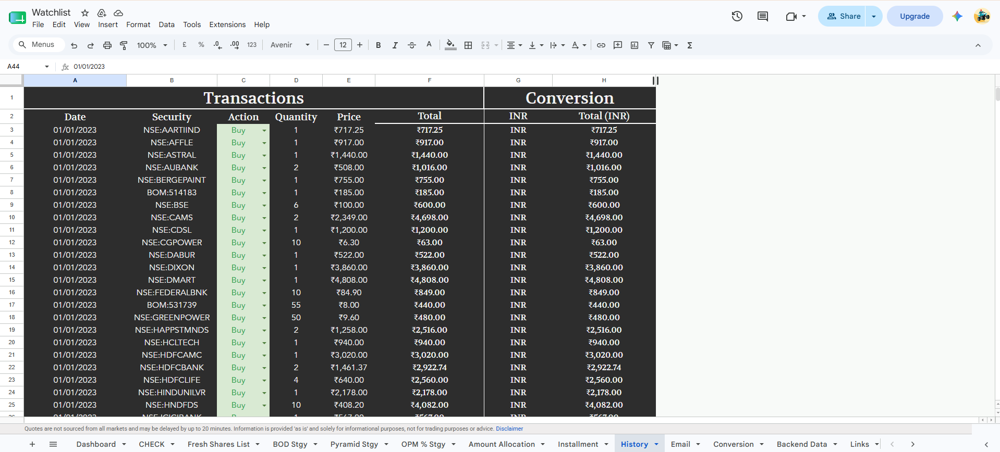
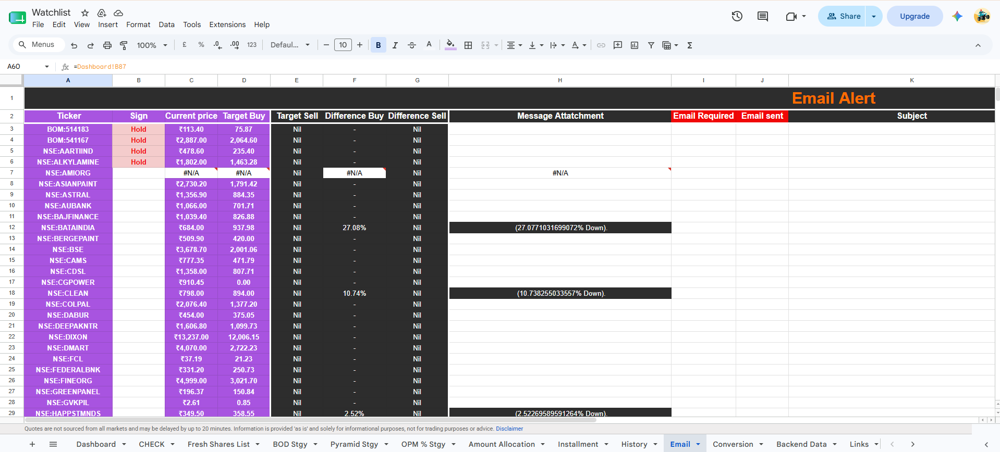
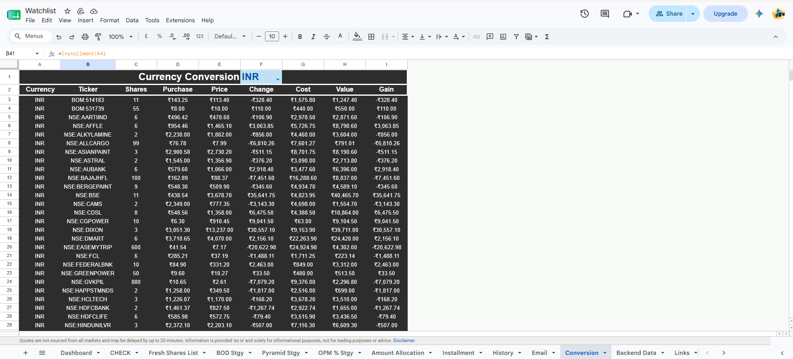

# Stock Watchlist and Portfolio Strategy Tracker

A Google Sheets based tool I built to track and manage a personal stock watchlist for NSE and BSE listed companies. It combines live market data, buy and hold signals, a dip-buying strategy, capital allocation tracking, and automated alert drafts into one workbook.

## Why I Built This

I was tracking over 80 stocks across different sources and kept running into the same issues. Global market data, individual stock signals, and my own notes were scattered across different tabs and apps. Buying decisions were often made on impulse rather than a plan I had already set for myself. I also found it hard to size positions consistently, since averaging into a stock as the price drops requires recalculating quantities and prices every time.

On top of that, I had no easy way to see how much capital I had already committed to a stock versus how much I had left, and I would often miss the exact moment a stock crossed a price level I cared about because I wasn't checking every stock every day.

I built this workbook to solve those problems for myself. It turns a plain watchlist into a rules based system that pulls live prices, classifies stocks by market cap, works out dip based entry points automatically, tracks the capital I've deployed, and drafts alert messages when a stock hits a target. Everything runs inside a spreadsheet, so there's no separate app or subscription involved.

This is meant for anyone managing a sizeable watchlist of Indian equities who wants a more disciplined, rules based approach to buying in stages rather than all at once.

## Preview

### Dashboard - Global Markets and Single Stock Overview

Live snapshot of major global indices such as the Dow, S&P 500, Nasdaq, Nifty, Sensex, Nikkei, FTSE and DAX, along with a single stock panel showing a 12 month trend and ADR prices for Indian companies listed in the US.

### CHECK - Before, During and After Market Summary

A condensed view split into before market, during market and after market sections, covering key indices and the major stocks I watch most closely, including HDFC, ICICI, TCS, Infosys and Reliance.

### BOD Strategy - Buy on Dip Entry Calculator

Works out the target buy price and quantity at every dip level from 20 percent to 80 percent below the 52 week high, for every stock on the list, with a live buy, hold or next signal at each level.

### OPM Percent Strategy - Fundamentals Overlay

Tracks operating profit margin percentage, net profit and borrowings across multiple years, plotted against a trendline. I use this to confirm a stock is fundamentally sound before adding to a position.

### Installment - Rule Based Position Building

Tracks target quantity against deficit quantity and whether the buying rule has been met at 15, 30, 50 and 70 percent price drops, so I know exactly when to add to a position.

### History - Transaction Log

A running log of every buy and sell transaction, with date, security, action, quantity, price and total, which feeds into the real cost basis for each holding.

### Email - Alert Drafts

Compares the current price against target buy and sell levels for each stock and prepares an alert message, for example noting a stock is down 27 percent, so I know which stocks have hit my entry rule.

### Conversion - Cost, Value and Gain Tracker

Tracks cost, current value and unrealised gain or loss per holding in INR, calculated directly from the installment and transaction data.

## What's Inside the Workbook

| Sheet | Purpose |
|---|---|
| Dashboard | Global index snapshot, single stock overview panel, and the master watchlist with buy, hold or sell signal, 52 week high and low, market cap, and target buy percentage. |
| CHECK | Before, during and after market summary of key indices, ADRs and major stock movers. |
| Fresh Shares List | A shortlist of newly tracked stocks with their own buy or hold signals and cap classification. |
| BOD Stgy | Buy on dip strategy. Calculates target buy prices and quantities at dip levels from 20 to 80 percent below the 52 week high. |
| Pyramid Stgy | Pyramid style averaging down, with low, medium, high and high high quantity tiers as price drops. |
| OPM Percent Stgy | Tracks operating profit margin, net profit and borrowings over several years per company for fundamental screening. |
| Amount Allocation | Tracks capital allotted, used and remaining per stock. |
| Installment | Rule based installment buying with target quantity, deficit quantity, and buy or hold rule at multiple dip thresholds. |
| History | The transaction log for the whole portfolio. |
| Email | Drafts buy or sell alerts by comparing current price against target levels. |
| Conversion | Cost, value and gain or loss tracker per holding. |
| Backend Data | Reference data such as company codes, exchange codes and dividend history. |
| Links | Reference notes and helper snippets used for data lookups. |
| Rules | The rulebook itself, covering installment percentages by market cap category, pyramid buying logic, and a share recovery percentage calculator. |

## Strategy Logic

Installment buying by market cap:

| Cap Size | First Installment | Second Installment |
|---|---|---|
| Small Cap | 30 percent | 35 percent |
| Mid Cap | 20 percent | 25 percent |
| Large Cap | 15 percent | 20 percent |
| Mega Cap | 10 to 15 percent | 20 percent |

Pyramid averaging rule: each subsequent buy equals twice the current total shares held, for example 1, then 2, then 6, then 18, then 54 shares.

General rule I follow: buy on red days, and always check overall market conditions before entering a new position.

## Custom Script - FIFO Cost Basis Calculator

Since transactions happen over time and at different prices, a simple average of purchase price stops being accurate once shares have been sold. To handle this properly, I wrote a small Google Apps Script function that applies FIFO, first in first out, accounting to the transaction log and returns the actual current shares held and average cost per ticker.

See scripts/fifo-cost-basis.gs

What it does:

- Reads every transaction row, ticker, action, quantity and price, from the History sheet.
- A Buy or DRIP action adds a new lot to that ticker's queue.
- A Split action adjusts every existing lot's share count and price by the split ratio, for example 2 to 1.
- A Sell action closes out the oldest lots first, splitting a lot if the sale only partially closes it.
- Returns ticker, shares held and average price for every ticker still holding shares.

Used directly as a custom formula in Sheets:

myDG(Security_range, Action_range, Quantity_range, Price_range)

This feeds the live shares held and average price figures used across the Installment, Conversion and Amount Allocation sheets, so target buy calculations are based on a real FIFO adjusted cost basis rather than a simple average.

To install it: open the Google Sheet, go to Extensions, then Apps Script, paste in the contents of fifo-cost-basis.gs, and save. The myDG function will then work like any built in Sheets formula.

## Features

- Live global market indices across the US, Europe and Asia
- Buy, hold or sell signal generation per stock
- Automatic target buy price calculation at multiple dip percentages
- Pyramid style averaging down for position sizing
- Capital allocation and installment tracking
- Automatically drafted buy and sell alert messages
- Market cap based visual bar per stock
- Dividend and fundamentals history log
- FIFO based cost basis calculation through a custom script

## How to Use

1. Download Watchlist.xlsx and open it in Excel, Google Sheets or LibreOffice Calc.
2. Update the watchlist table on the Dashboard sheet with your own tickers, using NSE or BSE format, for example NSE:TCS or BOM:514183.
3. Connect your preferred live price data source, such as Google Finance formulas or a market data plugin.
4. Check the BOD Stgy and Pyramid Stgy sheets for computed entry points as the price drops from the 52 week high.
5. Log allocated capital in Amount Allocation and track buy tranches in Installment.
6. Review the Email sheet for alert drafts whenever a price crosses your target buy or sell level.

This tool is for personal portfolio tracking and educational purposes only. It is not financial advice. Always do your own research before investing.

## Tech Used

- Google Sheets and Microsoft Excel, using formulas, conditional formatting, data tables and charts
- Google Apps Script for the custom FIFO cost basis function
- Live price feeds through spreadsheet native stock functions

## Repository Structure

Stock-Watchlist-Tracker
- Watchlist.xlsx, the main workbook
- scripts, containing fifo-cost-basis.gs, the Google Apps Script FIFO function
- images, containing the screenshots used in this README
- .gitignore
- README.md

## License

Feel free to use, modify and adapt this tracker for your own investing workflow. If you build on it publicly, a credit or link back is appreciated.

## Feedback

If you spot a formula improvement or want to suggest a new strategy sheet, open an issue or a pull request.
